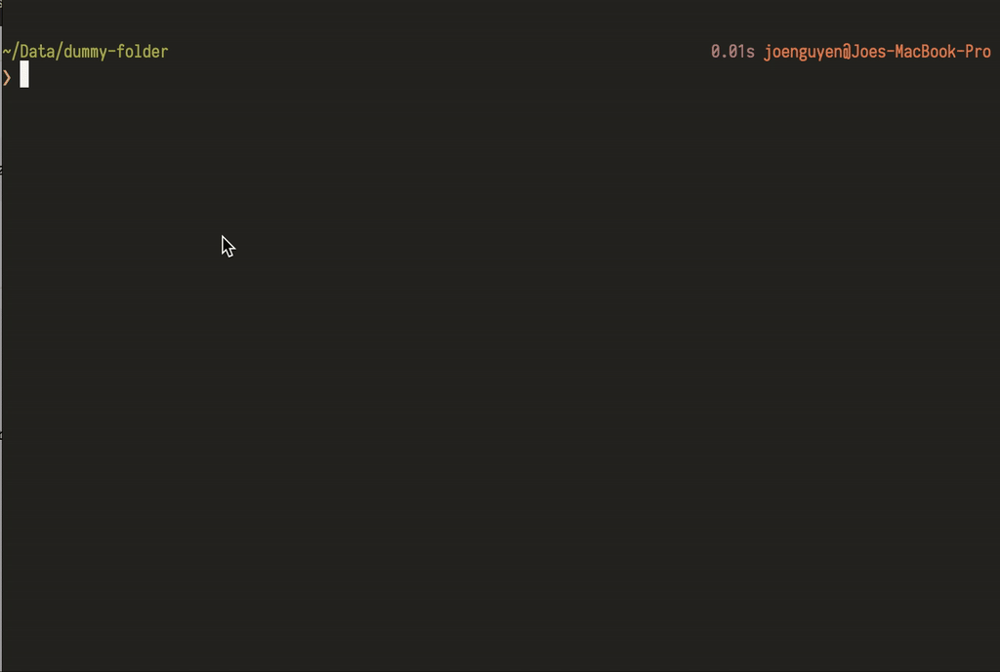

# Fuzzy New File (fnf)

CLI to create file/folder with fuzzy-file matching autocomplete.

The CLI will provide a list of searchable subdirectories of the current working directory for you to choose where you want to create nested folders/files.



## Installation

**Note**: The CLI requires Node v10 or above.

```bash
npm install -g fuzzy-new-file
```

**Tips**: If you are planning to use the CLI in a directory with a lot of subdirectories, to improve the performance significantly, I recommend installing [https://github.com/sharkdp/fd](https://github.com/sharkdp/fd) then use `--search-engine fd` when running the CLI.

## Usage

```bash
> fnf --help
fnf

Create file/folder with fuzzy-file matching autocomplete.

Options:
  --version        Show version number                                 [boolean]
  --help           Show help                                           [boolean]
  --root           Root folder where autocomplete will list its subdirectories.
                   Default is current working directory
  --no-ignore-vcs  Show search results from files and directories that would
                   otherwise be ignored by '.gitignore' files   [default: false]
  --search-engine
                    Search engine used to search for list of directories.
                    Possible values:
                    - fd: Very fast search engine, see:
                    https://github.com/sharkdp/fd. Require installation.
                    Recommended for directories having a lot of subdirectories
                    - node: Built-in node search logic, no need to install
                    anything.
                                       [choices: "node", "fd"] [default: "node"]
```

```bash
> cd dummy-folder # cd to the folder where you want to create file/folder inside

# ----------

> tree # List directories inside dummy-folder
.
├── bar
├── foo
└── random
    └── pictures

4 directories, 0 files

# ----------

> fnf
? Parent directory (Use arrow keys or type to search)
  bar
❯ foo
  random
  random/pictures
? Parent directory foo
? Target path (end the path with '/' to create a folder):
foo/ baz/a.js
File created: foo/baz/a.js

# ----------

❯ fnf
? Parent directory (Use arrow keys or type to search)
   bar
  foo
  random
  foo/baz
❯ random/pictures
? Parent directory random/pictures
? Target path (end the path with '/' to create a folder):
random/pictures/ mini-pictures/nested-mini-pictures/
Folder created: random/pictures/mini-pictures/nested-mini-pictures/

# ----------

> tree # List directories again
.
├── bar
├── foo
│   └── baz
│       └── a.js
└── random
    └── pictures
        └── mini-pictures
            └── nested-mini-pictures

7 directories, 1 file
```
